# Systems Engineering

The project provides an introduction to Systems Engineering

Images are custom. Confidential information is not displayed.

Please download the executable in https://github.com/alpaddesai/SystemsEngineering/releases

## Systems Engineering

## Systems Engineering Design Process

## Introduction
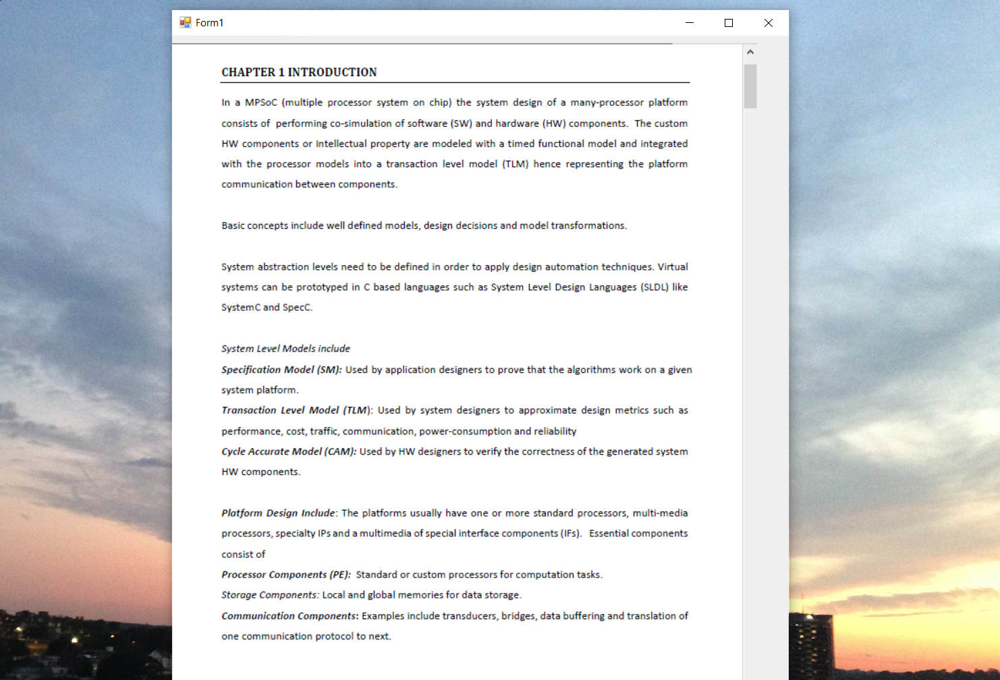

## System Design Methodologies
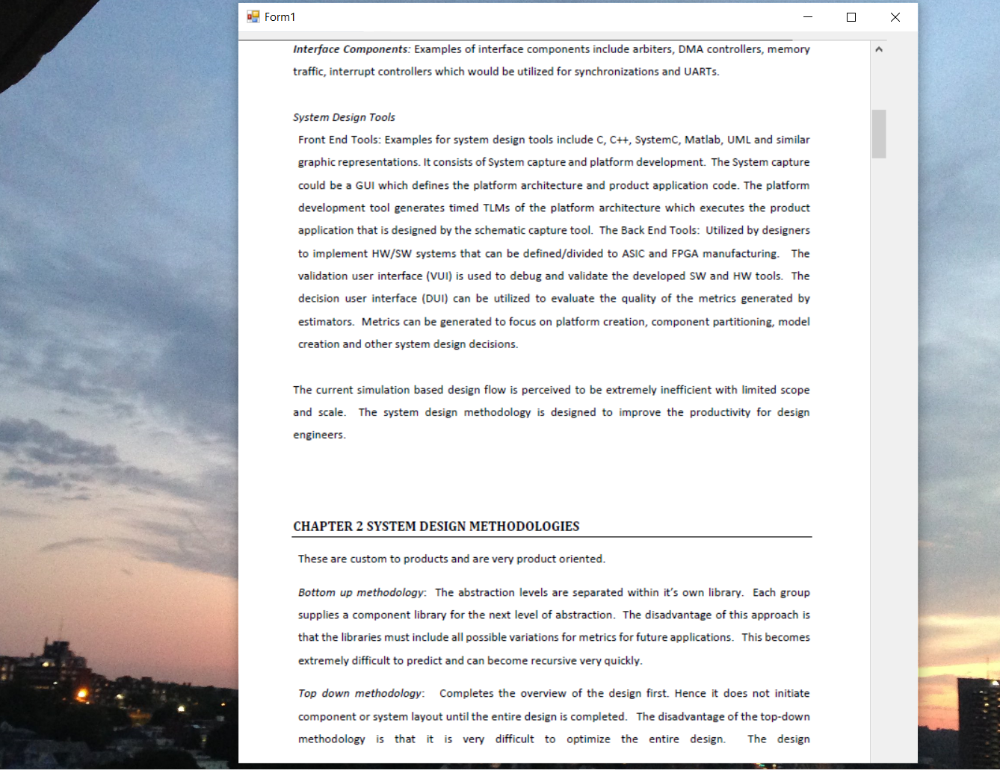

## System Design Methodologies
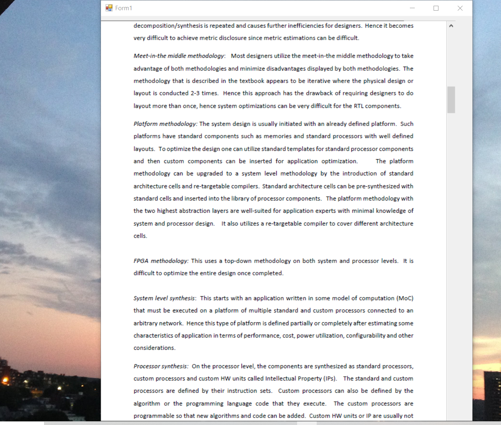

## Modeling
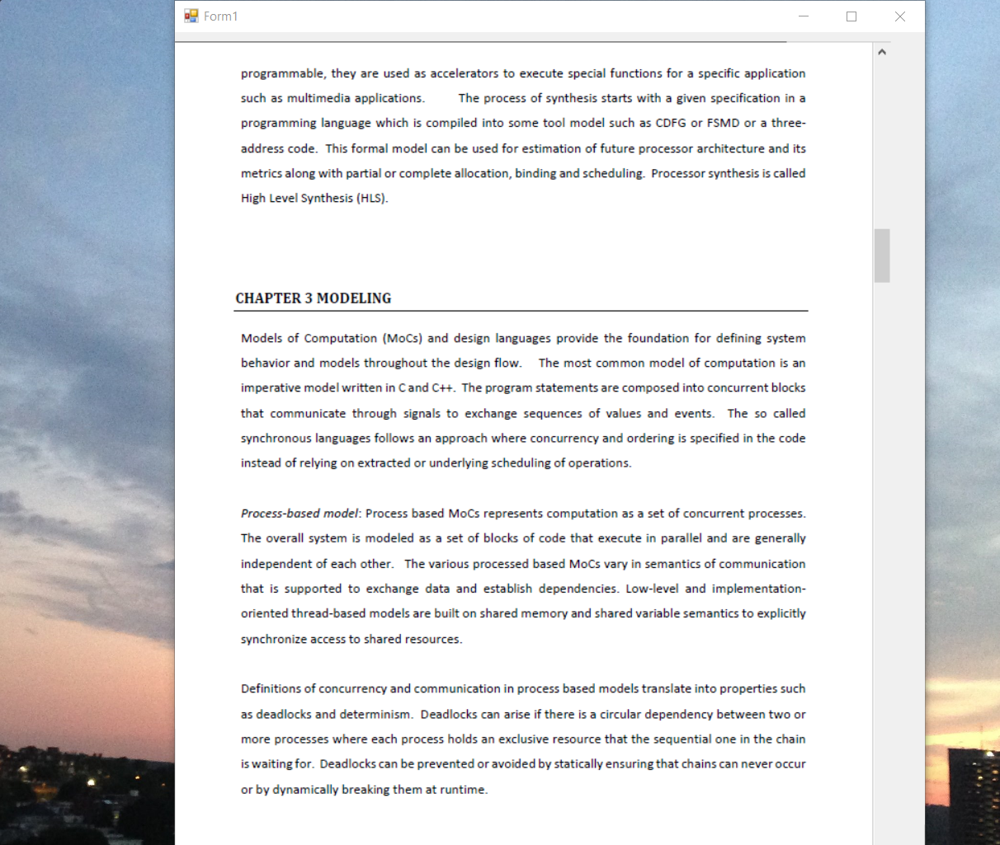

## Modeling
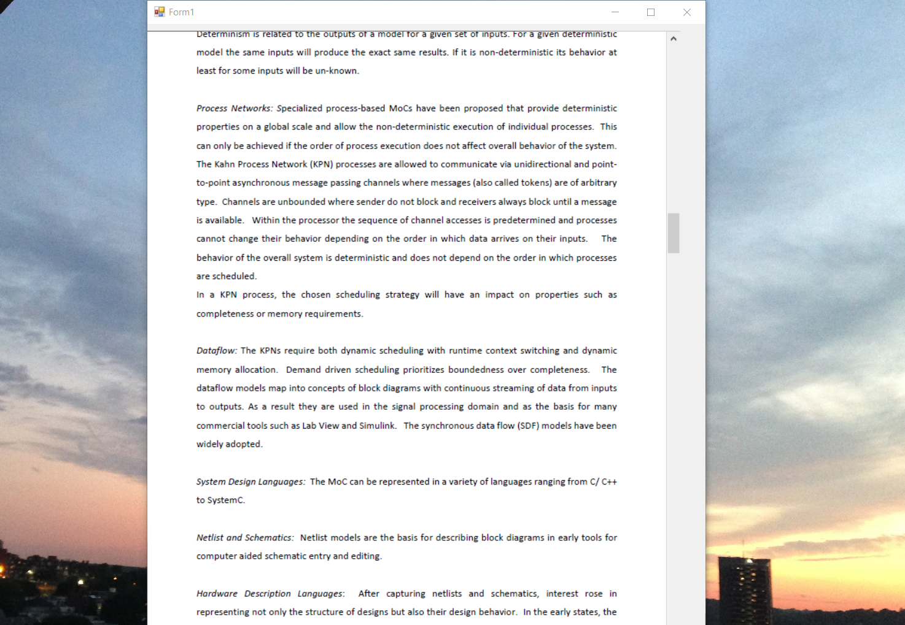

## Modeling
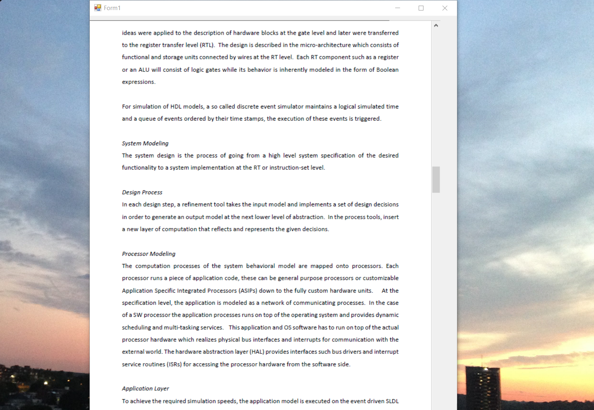

## Modeling
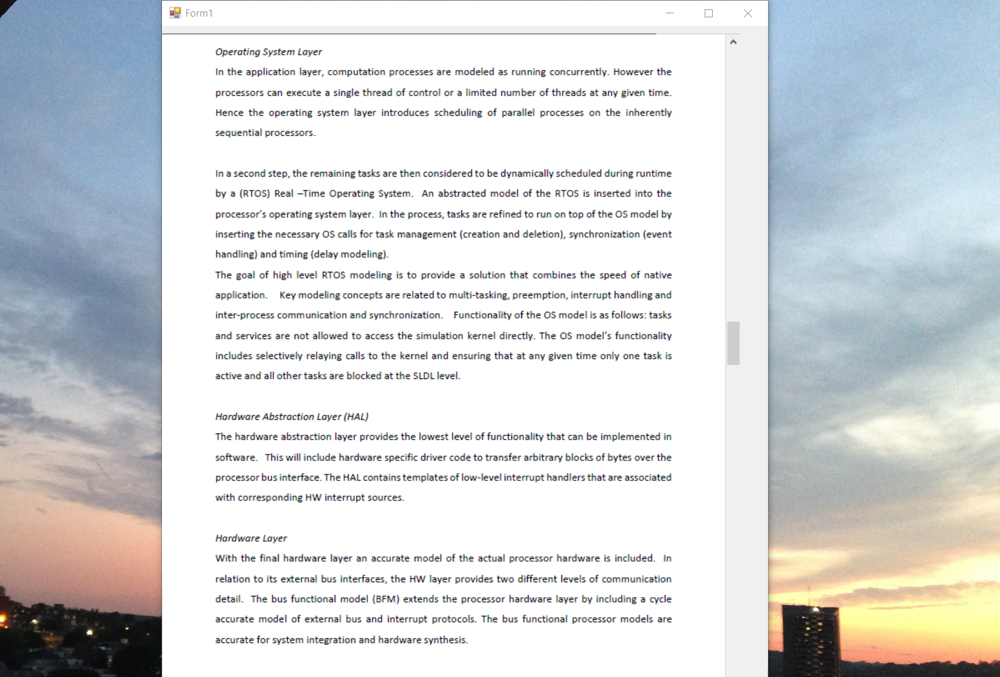

## Communication Modeling
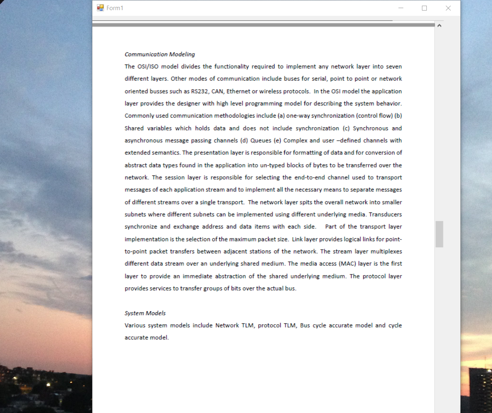

## System Synthesis

## Software Synthesis
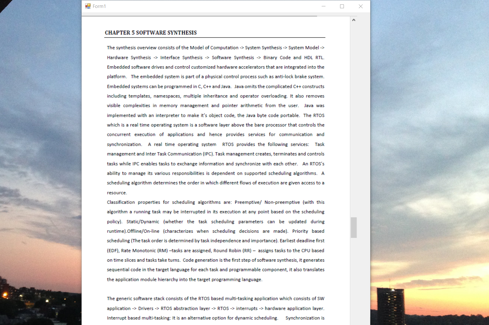

## Hardware Synthesis
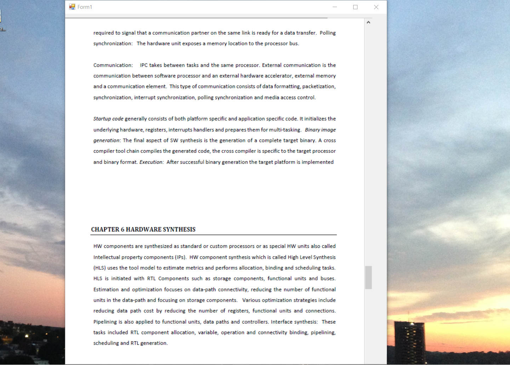

## Verification
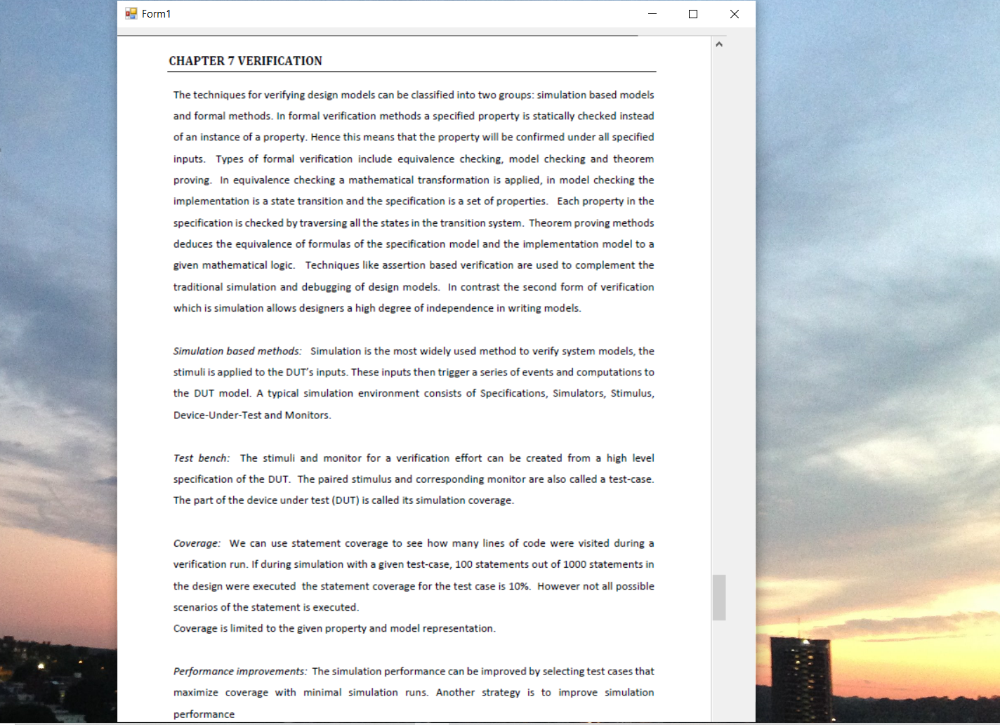

##  Opimization 

## Embedded Design
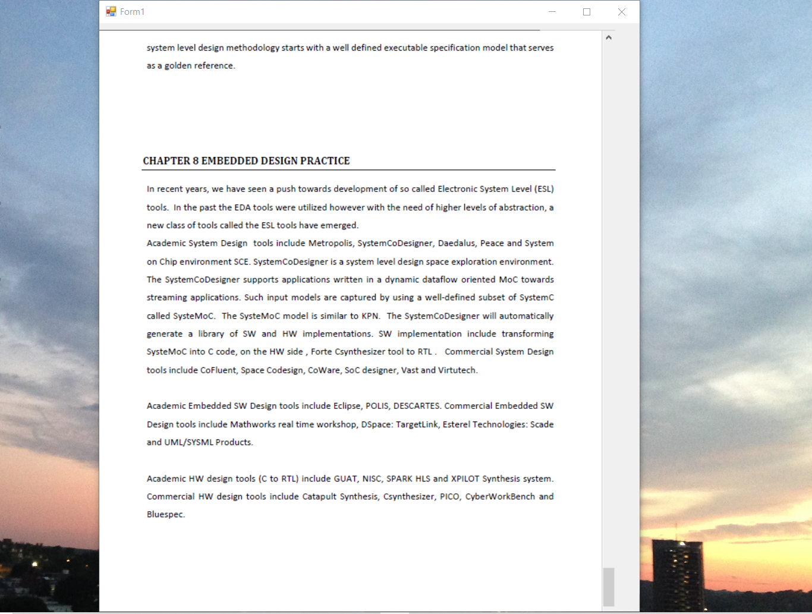
